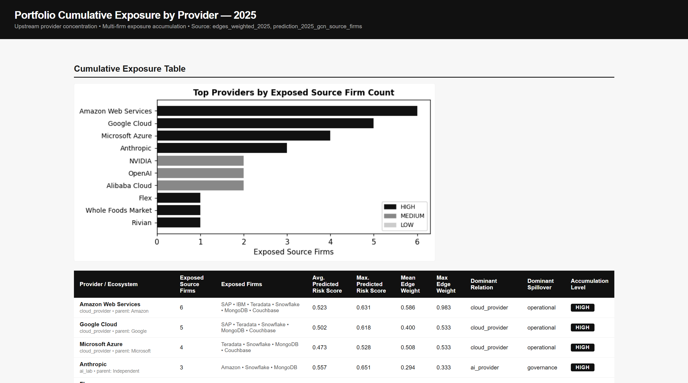
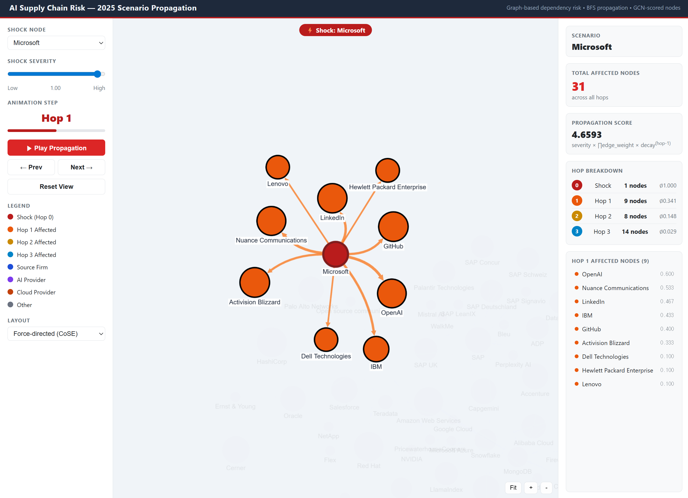

# GraphML-Based Cloud Infrastructure Risk Analysis

**Modeling hidden vendor dependencies across AI, cloud and SaaS ecosystems to surface
systemic risk that firm-level analysis cannot see.**


`Python` · `PyTorch Geometric` · `NetworkX` · `LLM-based information extraction` · `pandas`

> Competition project · Apr–May 2026 · 

---

## 1. Summary

Cloud and AI infrastructure vendors are deeply interdependent, but that dependency graph is
invisible in conventional risk reporting. A single outage at one provider cascades across an
entire ecosystem, and firm-level disclosures do not capture the second- and third-order
exposure.

This project makes that structure computable. An LLM extracts vendor relationships and risk
features from unstructured 10-K filings; entity resolution collapses the aliases; the result
is a directed dependency graph over which a GNN scores each node's systemic exposure. The
outputs are three tools an insurer can actually use — a per-firm risk profile, a
provider-level accumulation table, and a shock-propagation simulator.

| | |
|---|---|
| **Graph** | 193 canonical entities · 536 disclosed relationships · 12 focal firms |
| **Period** | 2022–2025 (train 2022–2024, predict 2025) |
| **Sources** | 10-K filings + an external incident panel |
| **Model** | 2-layer GCN, weakly supervised · **Spearman ρ = 0.852** vs 0.175 tabular |
| **Result** | 82 nodes scored for a year the model never saw |


---

## 2. AS-IS → TO-BE

Insurance already knows how to price accumulated risk — property insurers cap exposure per
flood plain, because one event triggers every policy in it. AI infrastructure has exactly
that structure with a different accumulation unit: not geography, but the cloud provider,
the foundation model, the API. **The difference is that a flood plain is visible on a map.**

An insurer can hold a portfolio diversified across industry, size and region, and still have
most of it sitting downstream of one cloud region.

| | **AS-IS** | **TO-BE** |
|---|---|---|
| **Evidence** | Self-reported applications and questionnaires | Outside-in extraction from public filings — no insured cooperation required |
| **Scope** | Internal security controls (MFA, patching, backups) | External infrastructure dependency, including providers the insured never names |
| **Unit** | One firm at a time, assessed independently | A network of firms and providers, with shared upstream nodes made explicit |
| **Trigger** | Security events — breach, ransomware, intrusion | Also non-security failure: region outage, API interruption, **terms-of-service change** |
| **Reach** | Direct relationships only | 2-hop cascades — your provider's provider, which appears in nobody's filing |
| **Answers** | "How risky is this firm?" | "**How many of our insureds fail together?**" |

### The term nobody was measuring

Portfolio loss variance decomposes into two parts:

```
Var(L_portfolio) = Σ wᵢ² Var(Lᵢ)   +   Σ(i≠j) wᵢwⱼ Cov(Lᵢ, Lⱼ)
                   └── individual ──┘    └──── correlated ────┘
                   priced well today       where this risk lives
```

Per-firm underwriting prices the first term. AI supply-chain risk lives almost entirely in
the second, and every insured firm added downstream of the same cloud region raises it.
Measuring covariance requires knowing which firms share which dependencies — a network
question that no table of firm attributes can answer.

→ [`docs/01-problem.md`](docs/01-problem.md)

---

## 3. So what — and what is new

### The tabular baseline does not just underperform. It ranks exposure backwards.

| Model | Uses graph? | Spearman ρ | MAE | RMSE |
|---|---|---|---|---|
| Ridge (tabular) | no | **−0.1375** | 0.1908 | 0.2179 |
| MLP (tabular) | no | 0.1750 | 0.1896 | 0.2140 |
| **GCN** | **yes** | **0.8522** | **0.0717** | **0.0971** |

A *negative* rank correlation means the firms whose own filings sound most alarming are, if
anything, not the ones the network actually exposes. This is the empirical case for the
whole approach — and it is why the MLP row matters: same eight features, comparable
capacity, no graph, ρ = 0.175. Non-linearity alone recovers almost nothing, so the jump to
0.852 is attributable to structure and not to model class.

All graph-derived quantities (pagerank, centrality, the exposure components) are excluded
from the feature set, or the comparison would prove nothing.

### Three things here that are not standard practice

**Catastrophe accumulation logic, relocated from geography to digital infrastructure.** The
actuarial machinery for correlated loss is mature; it has simply never been pointed at cloud
dependency. Framing AI infrastructure as an accumulation unit is what makes existing
underwriting tools apply.

**Weak supervision as the answer to absent loss labels.** The ideal label — which firms lost
how much when provider X failed — does not exist publicly and will not soon. Rather than
wait, a rule-based composite score becomes a proxy label, and the model learns the structural
pattern behind it. The limitation is stated plainly: the model is only as right as the rule,
and it is validated against no realised losses. What it adds is generalisation to graphs the
rule cannot cleanly evaluate.

**Explainability designed in, because insurance requires it.** A black-box score cannot be
priced into a policy an insurer must justify to a regulator. So exposure decomposes into four
components with four different remedies — direct exposure (reduce dependence), cascading
(demand upstream transparency), concentration (multi-cloud), non-substitutability (contract a
fallback) — and every score traces back to a specific disclosed sentence.

### What it found



**AWS is the clearest common-cause node in the graph.** A simulated AWS failure reaches
**43 nodes and 9 of the analysed focal firms** — most of the portfolio, from one event.
Six providers carry three or more focal firms downstream.

Hop-2 is where the surprise is: an AWS shock reaches only 6 nodes directly, but 30 at two
hops, carrying a *higher* total propagation score (3.91 vs 3.52), because AWS's direct
dependents are themselves infrastructure providers. **A one-hop view underestimates that
blast radius roughly fivefold.**

Top 2025 exposure — Amazon (0.651), Alibaba (0.648), IBM (0.631), Microsoft (0.620),
SAP (0.618), Oracle (0.612) — is not a size ranking. Revenue and market cap are not in the
feature set. These firms rank high on *position*: dense cross-dependency where every
connection is a channel in and a channel out.



→ [`docs/04-model.md`](docs/04-model.md) · [`docs/05-outputs.md`](docs/05-outputs.md)

---

## Repository

```
run_pipeline.py            entrypoint — --stage graph | model | report | all
src/
  config.py                every weight, path and year — the single source of truth
  step1_validate.py        data validation and quality report
  step2_snapshots.py       per-year graph snapshots, node typing
  step3_edge_weights.py    dependency strength from disclosure signals
  step4_node_vulnerability.py   intrinsic + incident + network criticality
  step5_risk_components.py      direct / cascading / concentration / substitutability
  step6_composite_risk.py       composite score → weak labels
  gnn/                     data loader, PyG builder, models, CV, training, prediction
  reporting/               risk profiles, cumulative exposure, scenarios, audit report
docs/                      problem · methodology · formulas · model · outputs
data/schema/               full variable dictionaries
data/samples/              synthetic panels so a clean clone runs end to end
outputs/                   real computed results (scores, predictions, scenarios)
figures/                   framework and dashboard figures
tools/                     sample generation, output scrubbing
```

```bash
pip install -r requirements.txt
python run_pipeline.py --stage graph        # steps 1–6
python -m src.gnn.cross_val                 # model ablation
python -m src.reporting.scenario_propagation --shock "Amazon Web Services"
```

### On reproducibility — read this before running

**The input panels are not distributed.** The incident data came from a commercial provider
under licence, and the extracted 10-K panels carry verbatim filing text. `data/raw/` is
git-ignored; the pipeline falls back to synthetic samples, says so loudly, and writes to
`outputs_sample/` so it can never overwrite the real results. Numbers produced from samples
are structurally valid and substantively meaningless.

Everything in `outputs/` is real — those are the actual computed results. They simply cannot
be regenerated from a clean clone. The full schemas are in
[`data/schema/`](data/schema/), and [`data/README.md`](data/README.md) documents how to
reconstruct the inputs from public sources.

### Limitations

- Outputs are **weakly supervised structural-exposure proxies**, validated against no
  realised losses. Not a forecast of firm failure.
- The incident signal is pooled across years, so it is a prior on node fragility rather than
  a time-varying signal.
- 12 focal firms is a small panel; these are infrastructure providers rather than a typical
  insurance book.
- Expected loss is specified but not computed — it needs insurer-internal data this project
  never had. Attaching plausible-looking currency figures to that gap would be worse than
  leaving it open.

---
---

<details>
<summary><b>한국어</b></summary>

# GraphML 기반 클라우드 인프라 리스크 분석

**AI·클라우드·SaaS 생태계에 숨어 있는 벤더 의존 구조를 모델링하여, 개별 기업 단위
분석으로는 보이지 않는 시스템 리스크를 드러냅니다.**

> 공모전 참여작 · 2026.04–05 · 역할: ML 엔지니어 / 데이터 사이언티스트

## 1. 요약

클라우드·AI 인프라 벤더는 서로 깊이 얽혀 있지만, 그 의존 관계는 기존 리스크 리포트에서
드러나지 않습니다. 한 공급자의 장애가 생태계 전반으로 연쇄되지만, 기업 단위 공시는 이러한
2·3차 노출을 포착하지 못합니다.

이 프로젝트는 그 구조를 계산 가능한 형태로 만듭니다. LLM이 비정형 10-K 공시에서 벤더 관계와
리스크 특성을 추출하고, 엔티티 정합화로 표기 불일치를 해소하며, 그 결과로 만들어진 방향성
의존 그래프 위에서 GNN이 각 노드의 시스템 노출도를 정량화합니다. 산출물은 보험사가 실제로
사용할 수 있는 세 가지 도구입니다 — 기업별 리스크 프로파일, 공급자별 누적 노출 테이블,
장애 전파 시뮬레이터.

| | |
|---|---|
| **그래프** | 정규화 엔티티 193개 · 공시 기반 관계 536건 · 분석 대상 기업 12개 |
| **기간** | 2022–2025 (학습 2022–2024, 예측 2025) |
| **데이터** | 10-K 공시 + 외부 리스크 사건 패널 |
| **모델** | 2-layer GCN, 약지도 학습 · **Spearman ρ = 0.852** (테이블 기반 0.175) |
| **결과** | 모델이 본 적 없는 연도의 82개 노드 스코어링 |

## 2. AS-IS → TO-BE

보험 산업은 이미 축적 리스크를 다루는 방법을 알고 있습니다. 손해보험사는 하나의 재해가 그
지역 내 모든 계약을 동시에 발동시키기 때문에 특정 지역별 노출 한도를 관리합니다. AI 인프라
리스크는 정확히 같은 구조를 가지되, 축적의 단위가 다릅니다 — 지리적 위치가 아니라 클라우드
공급자, 파운데이션 모델, API입니다. **차이는 홍수 범람원은 지도에 보이지만 이것은 보이지
않는다는 점입니다.**

보험사는 산업·규모·지역이 훌륭하게 분산된 포트폴리오를 보유하면서도, 그 대부분이 단일
클라우드 리전 아래에 놓여 있을 수 있습니다.

| | **AS-IS** | **TO-BE** |
|---|---|---|
| **근거** | 청약서·설문 등 자기보고 자료 | 공개 공시 기반 outside-in 추출 — 피보험자 협조 불필요 |
| **범위** | 내부 보안 통제 (MFA, 패치, 백업) | 외부 인프라 의존성 — 피보험 기업이 언급조차 하지 않는 공급자 포함 |
| **단위** | 개별 기업 단위 독립 평가 | 기업–공급자 네트워크, 공통 상위 노드를 명시적으로 식별 |
| **트리거** | 보안 사고 (침해, 랜섬웨어) | 보안 사고 없는 장애도 포함: 리전 장애, API 중단, **약관 변경** |
| **도달 범위** | 직접 관계만 | 2-hop 연쇄 — 어느 공시에도 나타나지 않는 '공급자의 공급자' |
| **답하는 질문** | "이 기업은 얼마나 위험한가?" | "**우리 계약 중 몇 건이 동시에 무너지는가?**" |

### 아무도 측정하지 않던 항

포트폴리오 손실의 분산은 두 항으로 분해됩니다.

```
Var(L_portfolio) = Σ wᵢ² Var(Lᵢ)   +   Σ(i≠j) wᵢwⱼ Cov(Lᵢ, Lⱼ)
                   └── 개별 위험 ──┘    └──── 상관 손실 ────┘
                   기존 심사가 잘 다루는 영역    이 리스크가 실제로 존재하는 곳
```

기존 언더라이팅은 첫 번째 항을 평가합니다. 그러나 AI 공급망 리스크는 거의 전적으로 두 번째
항에 있으며, 동일 클라우드 리전에 의존하는 피보험 기업이 늘어날수록 이 항은 커집니다.
공분산을 측정하려면 어떤 기업들이 어떤 의존성을 공유하는지 알아야 하고, 이는 기업 속성
테이블로는 답할 수 없는 네트워크 질문입니다.

## 3. 기대효과와 Novelty

### 테이블 기반 모델은 단순히 성능이 낮은 것이 아니라, 순위를 거꾸로 매깁니다

| 모델 | 그래프 사용 | Spearman ρ | MAE | RMSE |
|---|---|---|---|---|
| Ridge (테이블) | 아니오 | **−0.1375** | 0.1908 | 0.2179 |
| MLP (테이블) | 아니오 | 0.1750 | 0.1896 | 0.2140 |
| **GCN** | **예** | **0.8522** | **0.0717** | **0.0971** |

순위 상관계수가 *음수*라는 것은, 자사 공시에서 가장 위험해 보이는 기업이 실제로 네트워크가
노출시키는 기업과 오히려 어긋난다는 뜻입니다. 이것이 이 접근 전체의 실증적 근거이며, MLP
행이 중요한 이유이기도 합니다 — 동일한 8개 피처, 유사한 표현력, 그래프만 없는 조건에서
ρ = 0.175. 비선형성만으로는 거의 회복되지 않으므로, 0.852로의 도약은 모델 종류가 아니라
구조에 기인합니다.

그래프에서 파생된 값(PageRank, 중심성, 노출 구성요소)은 피처에서 모두 제외했습니다.
그렇지 않으면 이 비교 자체가 성립하지 않습니다.

### 기존 관행과 다른 세 가지

**재해 축적 리스크 논리를 지리에서 디지털 인프라로 이전.** 상관 손실을 다루는 계리적
도구는 이미 성숙해 있으며, 다만 클라우드 의존성에 적용된 적이 없을 뿐입니다. AI 인프라를
축적 단위로 재정의하는 것이 기존 언더라이팅 도구를 그대로 활용 가능하게 만듭니다.

**손실 레이블 부재에 대한 답으로서의 약지도 학습.** "공급자 X 장애 시 어떤 기업이 얼마나
손실을 입었는가"라는 이상적 레이블은 공개 데이터로 확보할 수 없으며 가까운 시일 내에도
어렵습니다. 이를 기다리는 대신, 규칙 기반 CompositeRisk를 대리 레이블로 삼아 모델이 그
구조적 패턴을 학습하게 했습니다. 한계는 명시합니다 — 모델은 규칙만큼만 정확하며, 실현
손실로 검증되지 않았습니다. 모델이 더하는 것은 규칙이 깨끗하게 계산할 수 없는 그래프로의
일반화입니다.

**설명 가능성을 설계에 내장 — 보험이 요구하기 때문.** 규제 당국에 설명해야 하는 보험사는
블랙박스 점수를 보험료에 반영할 수 없습니다. 따라서 노출도를 서로 다른 개선 수단을 갖는 네
구성요소로 분해했습니다 — Direct Exposure(의존 축소), Cascading(상위 공급망 투명성 요구),
Concentration(멀티클라우드), Non-Substitutability(대체 공급자 계약). 모든 점수는 공시상의
특정 문장으로 역추적됩니다.

### 분석 결과

**AWS는 그래프에서 가장 명확한 공통 원인 노드입니다.** AWS 장애 시뮬레이션은 **43개 노드와
분석 대상 기업 9개**에 도달합니다 — 단일 사건으로 포트폴리오 대부분이 영향을 받습니다.
3개 이상의 focal firm을 하위에 두는 공급자가 6곳입니다.

hop-2에서 반전이 나타납니다. AWS 장애는 직접적으로는 6개 노드에만 도달하지만 2-hop에서는
30개에 도달하며, 총 전파 점수도 더 높습니다(3.91 vs 3.52). AWS의 직접 의존처들이 그 자체로
인프라 공급자이기 때문입니다. **1-hop만 보는 관점은 이 피해 범위를 약 5배 과소평가합니다.**

2025년 상위 노출 기업 — Amazon(0.651), Alibaba(0.648), IBM(0.631), Microsoft(0.620),
SAP(0.618), Oracle(0.612) — 은 기업 규모 순위가 아닙니다. 매출·시가총액은 피처에
포함되지 않았습니다. 이들이 높은 이유는 *위치*입니다. 촘촘한 교차 의존 구조 속에서 모든
연결은 유입 경로이자 유출 경로가 됩니다.

## 재현성에 대하여

**입력 패널은 배포하지 않습니다.** 리스크 사건 데이터는 상용 라이선스 데이터이며, 추출된
10-K 패널은 공시 원문을 포함합니다. `data/raw/`는 git에서 제외되며, 파이프라인은 합성 샘플로
자동 대체하고 그 사실을 명시적으로 출력하며, 실제 결과를 덮어쓰지 않도록 `outputs_sample/`에
기록합니다. 샘플로 산출된 수치는 구조적으로는 유효하나 실질적 의미는 없습니다.

`outputs/`의 내용은 모두 실제 계산 결과입니다. 다만 clean clone에서 재생성할 수는 없습니다.
전체 스키마는 [`data/schema/`](data/schema/)에, 공개 자료로부터 입력을 재구성하는 방법은
[`data/README.md`](data/README.md)에 정리되어 있습니다.

## 한계

- 산출물은 **약지도 학습 기반 구조적 노출도 대리 지표**이며, 실현 손실로 검증되지
  않았습니다. 기업 부도나 사고 발생 예측이 아닙니다.
- 사건 신호는 연도별로 분리되지 않고 통합 집계되므로, 시점별 신호가 아니라 노드 취약성에
  대한 사전 정보에 가깝습니다.
- 분석 대상 12개 기업은 작은 패널이며, 일반적인 보험 포트폴리오가 아니라 인프라 공급자
  중심입니다.
- 기대손실 산식은 정의했으나 계산하지 않았습니다 — 보험사 내부 데이터가 필요하며, 이
  공백에 그럴듯한 금액을 채워 넣는 것은 공백으로 두는 것보다 나쁩니다.

</details>
