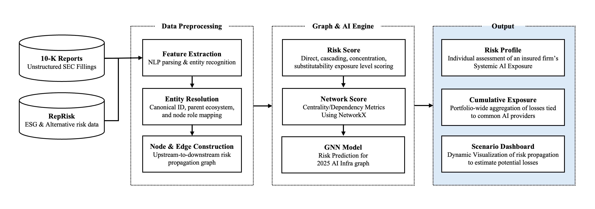

# 2. Building the dependency graph



## The constraint that shapes everything: outside-in

An insurer cannot see inside an insured firm. No SBOM, no architecture diagrams, no API call
volumes, no backup topology. Any method that assumes that access is a research artifact, not
an underwriting tool.

So the design is deliberately **outside-in**: estimate infrastructure dependence entirely
from public disclosure. It gives up precision — a 10-K names a cloud provider without saying
which regions or what share of workload — and buys three things that matter more in
practice: it works on any public company without their cooperation, it covers the whole
portfolio at once, and every score traces back to a citable sentence in a filed document,
which is what makes it defensible to a client and a regulator.

## Firm selection

12 focal firms, chosen from Gartner Magic Quadrant categories — Strategic Cloud Platform,
Cloud DB Management Systems, Data Science & ML Platforms — with 10-K filings collected for
2022–2025.

These firms are the *providers*, not a typical insurance book. That is intentional. They sit
at the centre of the AI supply chain, so their filings name the widest set of dependencies
and expose the ecosystem's structure. The framework maps onto an insurer's actual portfolio
by swapping which firms are focal; the machinery is unchanged.

## LLM extraction: what it is actually for

An LLM reads each filing and emits structured rows against a fixed schema:

- **Firm self-features** — 21 risk variables scored on [0,1] by *intensity*, not presence
  ([`data/schema/self_features.md`](../data/schema/self_features.md)). Presence is nearly
  constant — every tech 10-K mentions cybersecurity. Intensity is what varies.
- **Relationships** — for every counterparty named: relation type, dependency direction,
  contract scale, risk language, sole-source language, investment, spillover channel, source
  section, and the sentence itself
  ([`data/schema/edges.md`](../data/schema/edges.md)).

The point is not summarisation. It is turning ~48 filings of narrative prose into a table
with consistent columns, so that "how strongly does firm A depend on provider B" becomes a
number comparable across firms and years. Keyword matching cannot do this — "we rely on a
single supplier for these components, and an interruption would materially harm our
business" and "we also use AWS" both mention a vendor, and they are not the same fact.

Every extracted row keeps its source sentence and filing section, so nothing in the pipeline
is unattributable.

## Entity resolution

Names must collapse before the graph means anything. "Amazon Web Services", "AWS" and
"Amazon cloud infrastructure" become one canonical node, and each node carries its parent
ecosystem — see [`data/schema/master_mapping.md`](../data/schema/master_mapping.md) for why
this step decides whether the whole analysis is valid.

Result: **193 canonical entities**, **536 relationship observations**, **48 firm-year
self-feature observations**, plus an incident panel of **1,071 events**.

## Node types

| Type | Definition | Has self-features? |
|---|---|---|
| **Focal firm** (`source_firm`) | filed a 10-K that was parsed | yes |
| **Target entity** (`target_entity`) | only ever *mentioned* by someone else's filing | no |

Target entities are the interesting half. A cloud region or an API provider named by a dozen
customers has no filing in this dataset, no intrinsic risk score — and can still be the
single largest accumulation point in the portfolio, purely by structural position. The model
has to be able to score a node about which it knows nothing except who depends on it.

## Edge direction

Edges point **upstream origin → downstream exposed node**: from the provider whose failure
starts the problem, toward the firm that suffers it.

This is not the direction the data arrives in. A 10-K names *suppliers*, so the filer is
usually the exposed party, and mention direction is the reverse of risk direction. The
distinction is stored explicitly (`risk_source_id` / `risk_target_id`, with the rule that
derived it) rather than inferred, because getting it backwards inverts every downstream
result while still producing plausible-looking numbers.

## Four spillover channels

The same dependency transmits different failures. Recording which lets a scenario line up
with a coverage:

| Channel | Mechanism | Example | Typical coverage |
|---|---|---|---|
| **Operational** | provider failure → downstream interruption | cloud region outage, API down | CBI |
| **Security** | vulnerability or breach propagates | provider breach, compromised auth | cyber |
| **Performance** | latency or quality degradation reaches customers | slow model responses | Tech E&O |
| **Governance** | policy, access or regulatory change | model access restricted, terms change | often uncovered |

The governance row is the one worth noticing: a provider changing its terms of service can
impair a downstream business as effectively as an outage, and it fits no standard policy
trigger.

## Edge weights

Not every disclosed relationship is a real dependency. The weight separates
"we also use AWS" from "we have a multi-year commitment with no comparable alternative":

```
edge_weight = max(0.10, 0.40·contract_scale + 0.30·risk_language
                      + 0.20·no_alternative + 0.10·investment)
```

The floor is deliberate — a firm bothering to name a counterparty in a filing is itself
evidence of dependence. Full derivation in
[`03-risk-formulas.md`](03-risk-formulas.md).

---

Next: [3. Risk formulas](03-risk-formulas.md) · [4. Model](04-model.md)
