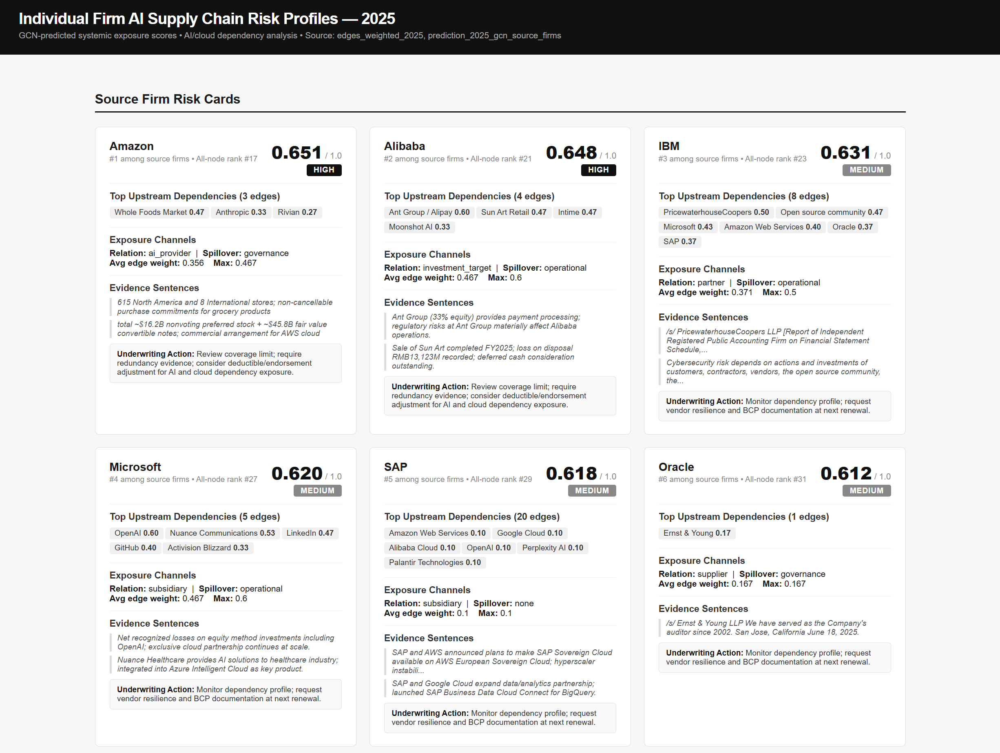
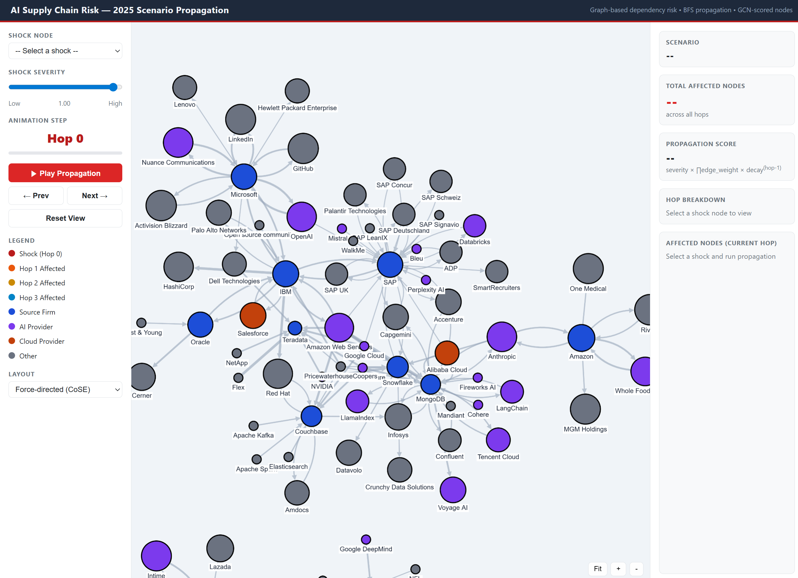
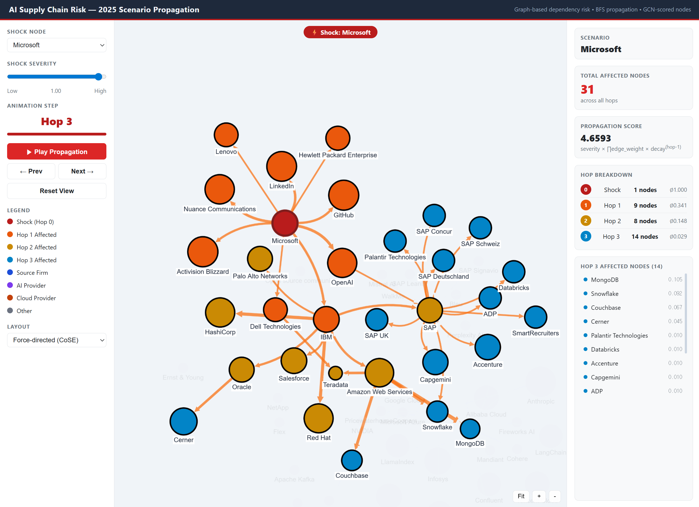

# 5. Outputs

Three deliverables, aimed at three different desks. Each answers a question the others
cannot.

---

## 1. Firm risk profile — the underwriter's card

`python -m src.reporting.risk_profile` →
`outputs/interpretation_report/risk_profiles_2025.html`

A score alone is not underwritable. The card carries the score **and its provenance**: named
upstream dependencies with weights, the dominant relation and spillover channel, average and
maximum edge weight, and a concrete action at renewal.

That structure is the answer to the explainability objection. An insurer cannot price a
black-box number into a policy it must justify to a regulator, and an underwriter who cannot
see why a score is high will not use it. So the card is built to be argued with — every
element traces to a disclosed relationship, and locally the pipeline also carries the source
sentence for each one.

The comparison it makes possible: two firms with identical revenue and industry, one on
multi-cloud with alternative APIs, one concentrated in a single region and a single model
API. Conventional underwriting prices them the same. This does not.

---

## 2. Cumulative exposure — the CRO's view

`python -m src.reporting.cumulative_exposure` →
`outputs/interpretation_report/cumulative_exposure_2025.html`

The inverse question, and the more dangerous one: **how many insured firms fail together?**

This is the catastrophe-accumulation calculation with the accumulation unit moved from
geography to infrastructure. Providers roll up by parent ecosystem, since AWS, Bedrock and
SageMaker share a failure domain.

2025 results — providers with three or more focal firms downstream:

| Provider | Exposed focal firms | Mean edge weight |
|---|---|---|
| Amazon Web Services | 6 | 0.586 |
| Google Cloud | 5 | 0.400 |
| PricewaterhouseCoopers | 5 | 0.223 |
| Microsoft Azure | 4 | 0.508 |
| IBM | 3 | 0.389 |
| Anthropic | 3 | 0.294 |

AWS is the clearest common-cause node in the graph — a single provider whose failure
correlates a large share of the book. Note also PwC: a professional-services firm appearing
beside the hyperscalers, because shared-dependency structure does not respect the category
"tech vendor". A concentration measure that only looked at cloud providers would have missed it.

This is what an insurer would act on: single-provider accumulation limits, restricting new
business above a threshold, adjusting coverage terms, or ceding to reinsurance.

---

## 3. Scenario propagation — what actually happens on the day

`python -m src.reporting.scenario_propagation --shock "Amazon Web Services"` →
`outputs/scenario_propagation/`

Output 2 is static: where the concentration sits. This is dynamic: pick a shock node and
watch the damage travel, hop by hop.

**Microsoft shock:** 31 affected nodes over 3 hops, 48 propagation paths.
Hop 1 reaches 9 nodes (OpenAI 0.600, Nuance 0.533, LinkedIn 0.467, IBM 0.433, GitHub 0.400 …),
hop 2 another 8, hop 3 another 17 — total propagation score 4.99, decaying from 3.07 at hop 1
to 0.69 at hop 3.

**AWS shock:** 43 affected nodes, 89 paths, **9 focal firms** — most of the analysed
portfolio, from one provider event.

The AWS case shows why hop-2 matters. Hop 1 reaches only 6 nodes, but hop 2 reaches 30 and
carries a *higher* total score (3.91 vs 3.52), because AWS's direct dependents are themselves
infrastructure providers with their own dependents. A one-hop view of that scenario would
underestimate the blast radius by a factor of five.

An underwriter does not have to read the whole graph — just select a provider and see which
chains lead where.

---

## What is deliberately not here

None of this produces a currency figure. Expected loss needs `T` (outage duration) and `L`
(loss per hour), which require provider outage histories and insurer-internal data — sums
insured, coverage limits, deductibles, industry BI sensitivities. The graph supplies the
other two terms: propagation probability and damage intensity are what path scores and edge
weights measure. Formula and gap analysis in
[`03-risk-formulas.md`](03-risk-formulas.md#expected-loss-design-not-implemented).

Attaching plausible-looking loss numbers to invented exposure values would be worse than
publishing none, because someone would use them.

---

## Supporting artifacts

`python -m src.reporting.interpretation_report` regenerates the audit layer in
`outputs/interpretation_report/`: graph overviews and ego networks per year, top-risk
subgraphs, score distributions and component decomposition, evidence chains tracing each high
score to the relationships behind it, and the model-vs-rule divergence analysis.
